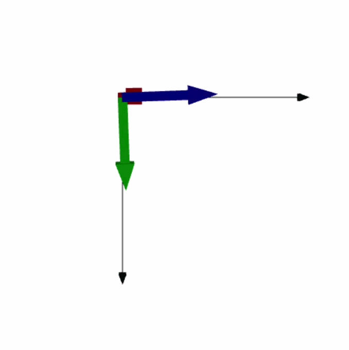
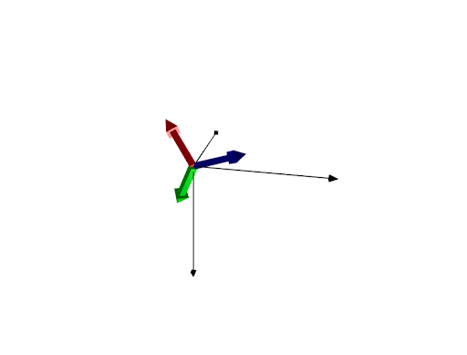
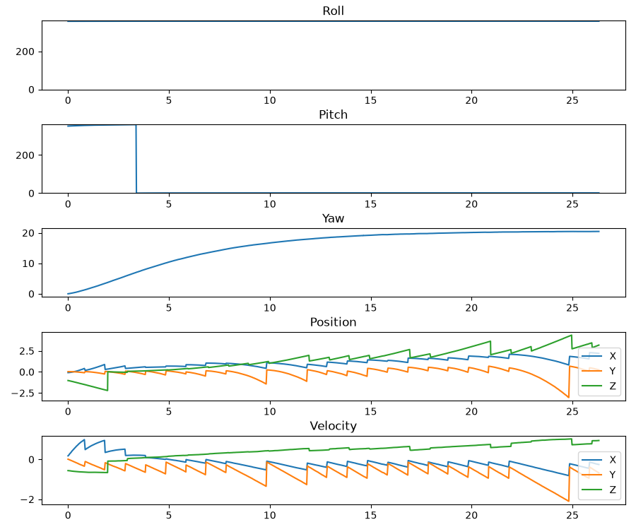

## INS Navigation System

## Overview
This project implements a low-cost Inertial Navigation System (INS) using an ESP32, IMU, magnetometer, and GPS receiver. The system estimates aircraft attitude, velocity, and position by combining inertial sensor measurements with GPS updates.

The project was developed as a personal aerospace controls and navigation project to explore sensor fusion, inertial navigation, and state estimation techniques.

## Features
Real-time attitude estimation using quaternions 
GPS position tracking  
3D orientation visualization  
State logging and post-flight analysis  
Serial communication between ESP32 and Python  

## Hardware
ESP32 - Main processor  
BN-880 GPS - GPS + magnetometer  
MPU 6050 - Accelerometer + gyroscope  
PC - Runs INS and visualization software  

## Software Architecture
IMU + GPS  
    |  
ESP32 Data Collection  
    |  
Serial Communication  
    |  
Python INS Algorithm  
    |  
    |- Attitude Estimation  
    |- Position Estimation  
    |- State Logging  
    |- Visualization  
    
## Repository Structure
liveINS.py  
plotLog.py  
readRawData.ino  
log.txt  
images/  
    -statePlot.png  
    -attitudeExample.png  
    
## Example Results
Attitude Visualization  

Flight State History  

## INS Algorithm
The navigation system uses:  
Gyroscope integration for short-term attitude propagation  
Accelerometer measurements for gravity reference  
Magnetometer measurements for heading correction  
GPS measurements for position updates  

The system estimates:  
Roll  
Pitch  
Yaw  
Velocity  
Position  

## Running the Project
Arduino  

Upload  
sensor_stream.ino  
to the ESP32.  

Python  

Install dependencies via pip:  
-numpy  
-matplotlib  
-pyserial  
-vpython  

With hardware setup, run:  
python liveINS.py  

If no hardware setup, to visualize example log, run:  
python plotLog.py  

## Future Improvements 
Barometric altitude integration  
Flight benchmarking  
Improved GPS outage handling  
Corrected initial yaw drift
